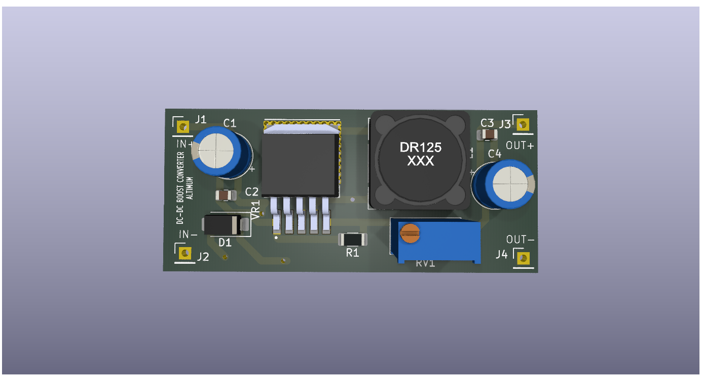
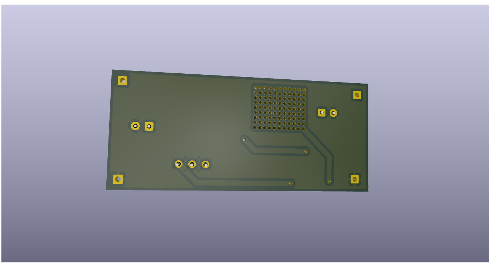

# DC-DC-BOOST CONVERTER PCB Design using KICAD -ALTIMUM
## PCB TOP VIEW

## PCB BOTTOM VIEW

## Project Overview🔧
This schematic represents a DC-DC boost converter designed as part of my learning process in PCB design using KiCad. The circuit works by stepping up a lower DC input voltage to a higher output voltage using the basic principle of energy storage and switching. When the switching element (typically a transistor or switching IC) turns ON, current flows through the inductor and energy is stored in its magnetic field. When the switch turns OFF, the inductor releases this stored energy, causing the voltage across it to rise. This higher voltage is then directed through a diode to the output capacitor, which smooths the voltage and supplies a stable DC output to the load. The capacitor also helps reduce ripple in the output voltage, while resistors in the circuit help regulate feedback and control the switching behavior. By repeatedly switching at high frequency, the circuit effectively boosts the input voltage to a higher level. Designing this schematic helped me understand both the working principle of boost converters and the practical aspects of schematic creation and PCB design using KiCad.
